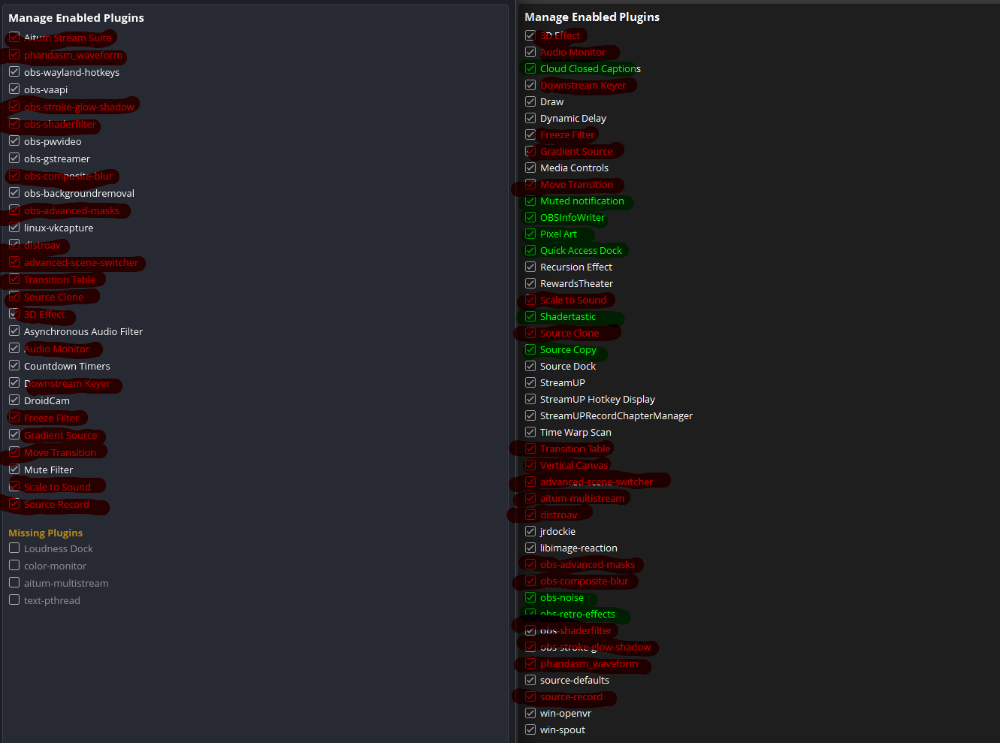

# OBS Plugins that NaGeL Needs and its not on Flathub

## Requirments
 1. flatpak-builder  
 just install it in your distro

## Usage
```bash
./build.sh <folderName or all>
```

## Status
### SourceCopy
Works!
### ClosedCaption
Flatpak builds, and add workaround to make it work:
`--env=LD_LIBRARY_PATH=/app/lib/`  
KDE Desktop file Command line argument:  
`run --env=LD_LIBRARY_PATH=/app/lib/ --branch=stable --arch=x86_64 --command=obs com.obsproject.Studio`

## Changelog

### 2026-04-10
Tried building ClosedCaption in flatpak context but could not make it happen.
But the work around works: https://github.com/ratwithacompiler/OBS-captions-plugin/issues/155#issuecomment-3498925450

### 2026-04-09
First Day and one plugin works rest needs to made later  
